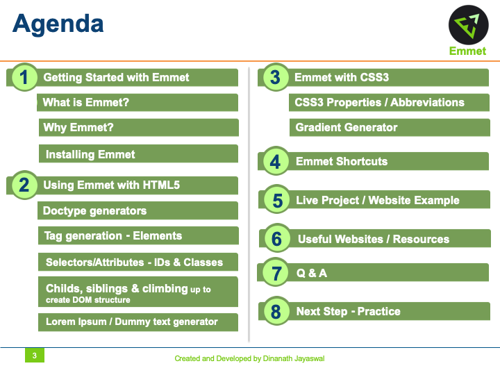
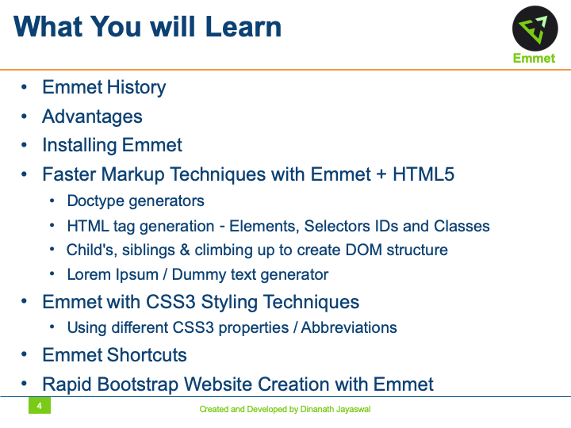
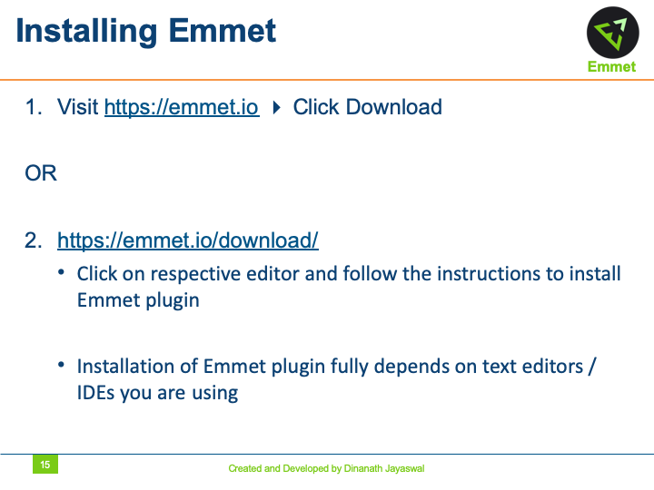
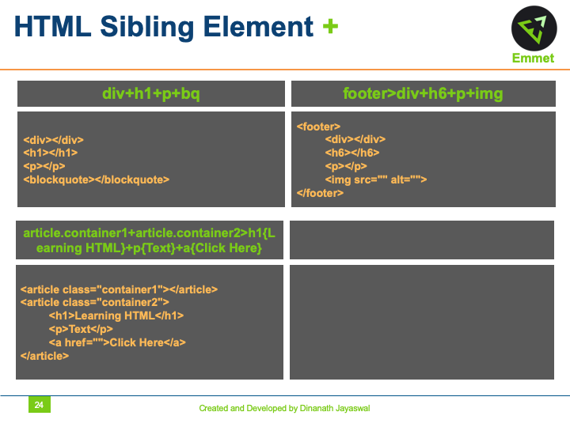
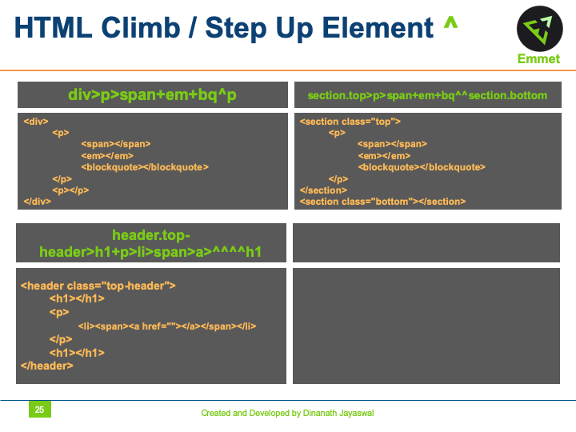
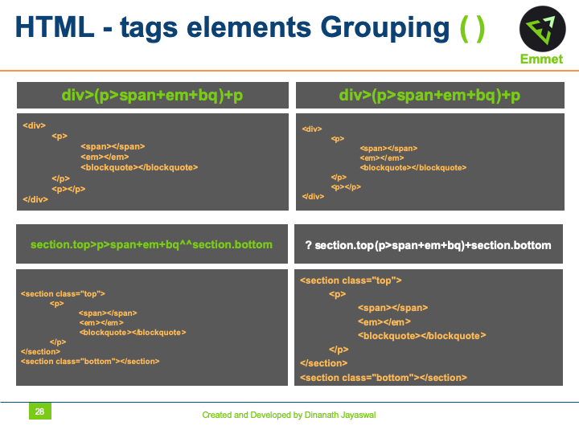
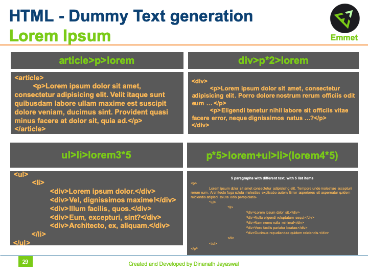
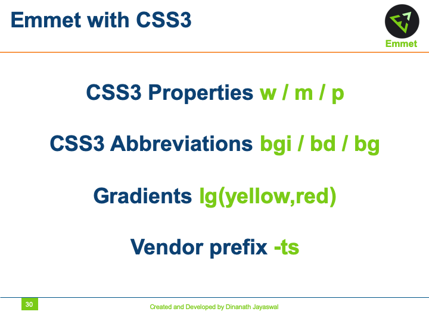
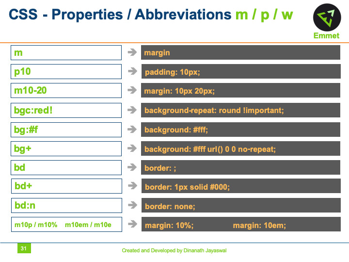

> **Description**:
In this course, let us learn and use a plugin called `emmet` which helps to make your workflow super smooth and efficient. I will show you many handy tricks that will do wonders in saving time when developing a project.

Emmet is a plugin for text editors that helps you write HTML and CSS faster and efficiently. Write quicker HTML5 & CSS3 productivity hacks with Emmet (Zen Coding). Faster HTML & CSS workflow with Emmet (Zen Coding). A Complete Guide to Improve HTML & CSS Workflow using Emmet. Accelerate HTML & CSS workflow with emmet coding faster techniques.

> **Topics (separate with spaces)**:
Add topics to categorize your repository and make it more discoverable.

- emmet
- emmet-html
- emmet-snippet
- emmet-abbreviations
- emmet-shortcut
- emmet-css
- zen-coding
- emmet-zen-coding
- zen-coding-html
- zen-coding-abbreviations
- zen-coding-shortcut
- installing-emmet
- emmet-installation
- emmet-html5
- emmet-css3
- emmet-doctype
- emmet-tag-generation
- emmet-child-sibling-climbing
- emmet-gradient-generator
- emmet-selector-class-id

 

 

Emmet - (Zen Coding)
=====================

`Emmet` is a plugin for text editors that helps you write HTML and CSS faster and efficiently. Write quicker HTML5 & CSS3 productivity hacks with Emmet (Zen Coding). Faster HTML & CSS workflow with Emmet (Zen Coding). A Complete Guide to Improve HTML & CSS Workflow using Emmet. Accelerate HTML & CSS workflow with emmet coding faster techniques.

Welcome
---------------------

Hi All, I'm **`Dinanath Jayaswal, Senior UI/Web Developer and Adobe Certified Expert Professional`**, I wanna welcome you to `Emmet - Faster coding techniques for HTML & CSS` - Beginners to Advanced level tutorial for all. 

About the Course/Tutorial
---------------------

In this course, let us learn to use a plugin called `emmet` which helps to make your workflow super smooth and efficient. I will show you many helpful/handy tricks that will do wonders in saving time when developing a project.

In this Tutorial/Class, Participants will learn how to write Codes/Markups/Styles/Properties without wasting of time. Without writing any tags or attributes, they will feel great; getting full Syntax of HTML and CSS just pressing `TAB` key on Keyboard and typing short letters or keywords only. It's a quite different way to write the codes for best Web Developers forever. No need to remember every tags/element or attribute/property. Without typing tags and attributes, they will get a response to all tags and attributes on screen. It's Time to have fun with Codes!!!

Will learn:
- How to code/write HTML tags and markup faster
- How to write CSS code/styles/properties faster
- How to take HTML & CSS coding to the next level with Emmet plugin in VS Code

Who is this for? Audience
---------------------

This Course/Tutorial is ideal for:
- Freshers
- Intermediates
- Web Designers/Developers, Front-End/UI Designers/Developers
- Candidates/Professionals who want to learn and master HTML & CSS faster coding hacks
- Anybody wanted to code HTML5, CSS3 or XML faster
- Any Developer looking to develop websites quickly with HTML & CSS or HTML5, CSS3
- Any coder looking to be more efficient when programming or developing with HTML & CSS
- Candidates desire to learn new techniques to improve skills
- Anyone want to be more productive writing HTML5 & CSS3 code

Course/Tutorial achievement
---------------------
Course/Tutorial Goal
---------------------

After completing/attending/finishing this Course/Tutorial, participants should be able to: 
- Write HTML & CSS code faster and in an efficient way
- Improve HTML & CSS workflow with Short Codes
- Participants will be able to write HTML5 & CSS3 codes within a fraction of seconds with various emmet hacks

Prerequisites for current course / What you need to know
---------------------

- Participants need to know and have Basic/Intermediate knowledge of HTML and CSS or HTML5 and CSS3
- How to use a text editor such as Notepad++, Sublime Text and/or IDE like Visual Studio Code 

Topics included/covered
=====================

1. [Introduction to Emmet](#1-introduction-to-emmet)
    - 1.1. [Emmet (Zen Coding)](#11-emmet-zen-coding)
    - 1.2. [Welcome](#12-welcome)
    - 1.3. [Agenda](#13-agenda)
    - 1.4. [What You will Learn](#14-what-you-will-learn)
    - 1.5. [How long you need to complete?](#15-how-long-you-need-to-complete)
    - 1.6. [Emmet Zen Coding Code Like a Pro](#16-emmet-zen-coding-code-like-a-pro)
    - 1.7. [What is Emmet?](#17-what-is-emmet)
    - 1.8. [Text Editors and IDEs](#18-text-editors-and-ides)
    - 1.9. [Why Emmet Advantages of Emmet](#19-why-emmet-advantages-of-emmet)
    - 1.10. [Installing Emmet](#110-installing-emmet) | [Installing Emmet Zen Coding](#110-installing-emmet-zen-coding) | [Setup Emmet Zen Coding](#110-setup-emmet-zen-coding)
    - 1.11. [Emmet Short Cut Issue Head Up](#111-emmet-short-cut-issue-head-up)
2. [Using Emmet with HTML5](#2-using-emmet-with-html5)
    - 2.1. [Using Emmet with HTML5 Symbol Syntax)](#21-Using-emmet-with-html5-symbol-syntax)      
    - 2.2. [HTML Doc Types ! Html:5 html:4t](#22-html-doc-types)
    - 2.3. [HTML Tag Elements - name](#23-html-tag-elements-name)
    - 2.4. [HTML Tag Selectors - Attributes - IDs and Classes . # { }](#24-html-tag-selectors-attributes-ids-and-classes)
    - 2.5. [HTML Child Element >](#25-html-child-element)
    - 2.6. [HTML Sibling Element +](#26-html-sibling-element)
    - 2.7. [HTML Climb-Step Up Element ^](#27-html-climb-step-up-element)
    - 2.8. [HTML Math Numbering Multiply Replicate tags elements * $ @](#28-html-math-numbering-multiply-replicate-tags-elements)
    - 2.9. [HTML tags elements Grouping ( )](#29-html-tags-elements-grouping)
    - 2.10. [HTML Dummy Text generation Lorem Ipsum](#210-html-dummy-text-generation-lorem-ipsum)
3. [Using Emmet with CSS3](#3-using-emmet-with-css3)
    - 3.1. [Using Emmet with CSS3 Symbol Syntax)](#31-Using-emmet-with-css3-symbol-syntax)
    - 3.2. [CSS Properties / Abbreviations m / p / w](#32-css-properties-abbreviations-m-p-w)

1 Introduction to Emmet
=====================

1.1. Emmet Zen Coding
---------------------

  <figure>
    &nbsp;&nbsp;&nbsp; 
    <figcaption>&nbsp;&nbsp;&nbsp; Image - Emmet (Zen Coding) Tutorial - Banner</figcaption>
  </figure>

1.2. Welcome
---------------------

  <figure>
    &nbsp;&nbsp;&nbsp; 
    <figcaption>&nbsp;&nbsp;&nbsp; Image - Emmet (Zen Coding) Tutorial - Welcome</figcaption>
  </figure>

1.3. Agenda
---------------------

  <figure>
    &nbsp;&nbsp;&nbsp; 
    <figcaption>&nbsp;&nbsp;&nbsp; Image - Emmet (Zen Coding) Tutorial - Agenda</figcaption>
  </figure>

1.4. What You will Learn
---------------------

  <figure>
    &nbsp;&nbsp;&nbsp; 
    <figcaption>&nbsp;&nbsp;&nbsp; Image - Emmet (Zen Coding) Tutorial - What You will Learn</figcaption>
  </figure>

1.5. How long you need to complete?
---------------------

  <figure>
    &nbsp;&nbsp;&nbsp; 
    <figcaption>&nbsp;&nbsp;&nbsp; Image - Emmet (Zen Coding) Tutorial - How long you need to complete?</figcaption>
  </figure>

  <figure>
    &nbsp;&nbsp;&nbsp; 
    <figcaption>&nbsp;&nbsp;&nbsp; Image - Emmet (Zen Coding) Tutorial - How long you need to complete?</figcaption>
  </figure>

1.6. Emmet Zen Coding Code Like a Pro
---------------------

  <figure>
    &nbsp;&nbsp;&nbsp; 
    <figcaption>&nbsp;&nbsp;&nbsp; Image - Emmet (Zen Coding) Tutorial - Emmet Zen Coding Code Like a Pro</figcaption>
  </figure>

1.7. What is Emmet?
---------------------

  <figure>
    &nbsp;&nbsp;&nbsp; 
    <figcaption>&nbsp;&nbsp;&nbsp; Image - Emmet (Zen Coding) Tutorial - What is Emmet?</figcaption>
  </figure>

  <figure>
    &nbsp;&nbsp;&nbsp; 
    <figcaption>&nbsp;&nbsp;&nbsp; Image - Emmet (Zen Coding) Tutorial - What is Emmet?</figcaption>
  </figure>

1.8. Text Editors and IDEs
---------------------

  <figure>
    &nbsp;&nbsp;&nbsp; 
    <figcaption>&nbsp;&nbsp;&nbsp; Image - Emmet (Zen Coding) Tutorial - Text Editors and IDEs</figcaption>
  </figure>

1.9. Why Emmet Advantages of Emmet
---------------------

  <figure>
    &nbsp;&nbsp;&nbsp; 
    <figcaption>&nbsp;&nbsp;&nbsp; Image - Emmet (Zen Coding) Tutorial - Why Emmet Advantages of Emmet</figcaption>
  </figure>

  <figure>
    &nbsp;&nbsp;&nbsp; 
    <figcaption>&nbsp;&nbsp;&nbsp; Image - Emmet (Zen Coding) Tutorial - Why Emmet Advantages of Emmet</figcaption>
  </figure>

  <figure>
    &nbsp;&nbsp;&nbsp; 
    <figcaption>&nbsp;&nbsp;&nbsp; Image - Emmet (Zen Coding) Tutorial - Why Emmet Advantages of Emmet</figcaption>
  </figure>

  <figure>
    &nbsp;&nbsp;&nbsp; 
    <figcaption>&nbsp;&nbsp;&nbsp; Image - Emmet (Zen Coding) Tutorial - Why Emmet Advantages of Emmet</figcaption>
  </figure>

1.10. Installing Emmet
---------------------
1.10. Installing Emmet Zen Coding
---------------------
1.10. Setup Emmet Zen Coding
---------------------

In this section, we will learn how to set up/install Emmet, a special plugin in your favorite Text Editor/IDE:

  <figure>
    &nbsp;&nbsp;&nbsp; 
    <figcaption>&nbsp;&nbsp;&nbsp; Image - Emmet (Zen Coding) Tutorial - Installing Emmet Zen Coding</figcaption>
  </figure>

  <figure>
    &nbsp;&nbsp;&nbsp; 
    <figcaption>&nbsp;&nbsp;&nbsp; Image - Emmet (Zen Coding) Tutorial - Installing Emmet Zen Coding</figcaption>
  </figure>

1.11. Emmet Short Cut Issue Head Up
---------------------

  <figure>
    &nbsp;&nbsp;&nbsp; 
    <figcaption>&nbsp;&nbsp;&nbsp; Image - Emmet (Zen Coding) Tutorial - Emmet Short Cut Issue Head Up</figcaption>
  </figure>

2 Using Emmet with HTML5
=====================

2.1. Using Emmet with HTML5 Symbol syntax
---------------------

  <figure>
    &nbsp;&nbsp;&nbsp; 
    <figcaption>&nbsp;&nbsp;&nbsp; Image - Emmet (Zen Coding) Tutorial - Using Emmet with HTML5 - Symbol Syntax</figcaption>
  </figure>

  <figure>
    &nbsp;&nbsp;&nbsp; 
    <figcaption>&nbsp;&nbsp;&nbsp; Image - Emmet (Zen Coding) Tutorial - Using Emmet with HTML5 - Symbol Syntax</figcaption>
  </figure>

2.2. HTML Doc Types
---------------------
2.2. HTML Doc Types ! Html:5 html:4t
---------------------

  <figure>
    &nbsp;&nbsp;&nbsp; 
    <figcaption>&nbsp;&nbsp;&nbsp; Image - Emmet (Zen Coding) Tutorial - HTML Doc Types ! Html:5 html:4t</figcaption>
  </figure>

2.3. HTML Tag Elements-name
---------------------
2.3. HTML Tag Elements - name
---------------------

  <figure>
    &nbsp;&nbsp;&nbsp; 
    <figcaption>&nbsp;&nbsp;&nbsp; Image - Emmet (Zen Coding) Tutorial - HTML Tag Elements - name</figcaption>
  </figure>

2.4. HTML Tag Selectors-Attributes-IDs and Classes
---------------------
2.4. HTML Tag Selectors - Attributes - IDs and Classes . # { }
---------------------
2.4. HTML Tag Selectors - Attributes - IDs and Classes . # [ ] { }
---------------------

  <figure>
    &nbsp;&nbsp;&nbsp; 
    <figcaption>&nbsp;&nbsp;&nbsp; Image - Emmet (Zen Coding) Tutorial - HTML Tag Selectors - Attributes - IDs and Classes . # [ ] { }</figcaption>
  </figure>

2.5. HTML Child Element
---------------------
2.5. HTML Child Element >
---------------------

  <figure>
    &nbsp;&nbsp;&nbsp; " title="Emmet (Zen Coding) Tutorial - HTML Child Element >" width="1000" border="2" />
    <figcaption>&nbsp;&nbsp;&nbsp; Image - Emmet (Zen Coding) Tutorial - HTML Child Element ></figcaption>
  </figure>

2.6. HTML Sibling Element
---------------------
2.6. HTML Sibling Element +
---------------------

  <figure>
    &nbsp;&nbsp;&nbsp; 
    <figcaption>&nbsp;&nbsp;&nbsp; Image - Emmet (Zen Coding) Tutorial - HTML Sibling Element +</figcaption>
  </figure>

2.7. HTML Climb-Step Up Element
---------------------
2.7. HTML Climb-Step Up Element ^
---------------------
2.7. HTML Climb - Step Up Element ^
---------------------

  <figure>
    &nbsp;&nbsp;&nbsp; 
    <figcaption>&nbsp;&nbsp;&nbsp; Image - Emmet (Zen Coding) Tutorial - HTML Climb-Step Up Element ^</figcaption>
  </figure>

2.8. HTML Math Numbering Multiply Replicate tags elements
---------------------
2.8. HTML Math Numbering Multiply Replicate tags elements * $ @
---------------------

  <figure>
    &nbsp;&nbsp;&nbsp; 
    <figcaption>&nbsp;&nbsp;&nbsp; Image - Emmet (Zen Coding) Tutorial - HTML Math Numbering, Multiply, Replicate tags elements * $ @</figcaption>
  </figure>

  <figure>
    &nbsp;&nbsp;&nbsp; 
    <figcaption>&nbsp;&nbsp;&nbsp; Image - Emmet (Zen Coding) Tutorial - HTML Math Numbering, Multiply, Replicate tags elements * $ @</figcaption>
  </figure>

2.9. HTML tags elements Grouping
---------------------
2.9. HTML tags elements Grouping ( )
---------------------

  <figure>
    &nbsp;&nbsp;&nbsp; 
    <figcaption>&nbsp;&nbsp;&nbsp; Image - Emmet (Zen Coding) Tutorial - HTML tags elements Grouping ( )</figcaption>
  </figure>

2.10. HTML Dummy Text generation Lorem Ipsum
---------------------
2.10. HTML Dummy Text generation
---------------------

  <figure>
    &nbsp;&nbsp;&nbsp; 
    <figcaption>&nbsp;&nbsp;&nbsp; Image - Emmet (Zen Coding) Tutorial - HTML Dummy Text generation Lorem Ipsum</figcaption>
  </figure>

3 Using Emmet with CSS3
=====================

3.1. Using Emmet with CSS3 Symbol syntax
---------------------

  <figure>
    &nbsp;&nbsp;&nbsp; 
    <figcaption>&nbsp;&nbsp;&nbsp; Image - Emmet (Zen Coding) Tutorial - Using Emmet with CSS3 Symbol Syntax</figcaption>
  </figure>

3.2. CSS Properties Abbreviations m p w
---------------------
3.2. CSS Properties / Abbreviations m / p / w
---------------------

  <figure>
    &nbsp;&nbsp;&nbsp; 
    <figcaption>&nbsp;&nbsp;&nbsp; Image - Emmet (Zen Coding) Tutorial - CSS Properties / Abbreviations m / p / w</figcaption>
  </figure>

