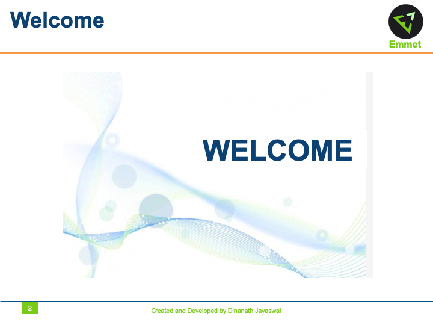

> **Description**:
In this course, let us learn and use a plugin called `emmet` which helps to make your workflow super smooth and efficient. I will show you many handy tricks that will do wonders in saving time when developing a project.

Emmet is a plugin for text editors that helps you write HTML and CSS faster and efficiently. Write quicker HTML5 & CSS3 productivity hacks with Emmet (Zen Coding). Faster HTML & CSS workflow with Emmet (Zen Coding). A Complete Guide to Improve HTML & CSS Workflow using Emmet. Accelerate HTML & CSS workflow with emmet coding faster techniques.

> **Topics (separate with spaces)**:
Add topics to categorize your repository and make it more discoverable.

- emmet
- emmet-html
- emmet-snippet
- emmet-abbreviations
- emmet-shortcut
- emmet-css
- zen-coding
- emmet-zen-coding
- zen-coding-html
- zen-coding-abbreviations
- zen-coding-shortcut
- installing-emmet
- emmet-installation
- emmet-html5
- emmet-css3
- emmet-doctype
- emmet-tag-generation
- emmet-child-sibling-climbing
- emmet-gradient-generator
- emmet-selector-class-id

 

 

Emmet - (Zen Coding)
=====================

`Emmet` is a plugin for text editors that helps you write HTML and CSS faster and efficiently. Write quicker HTML5 & CSS3 productivity hacks with Emmet (Zen Coding). Faster HTML & CSS workflow with Emmet (Zen Coding). A Complete Guide to Improve HTML & CSS Workflow using Emmet. Accelerate HTML & CSS workflow with emmet coding faster techniques.

Welcome
---------------------

Hi All, I'm **`Dinanath Jayaswal, Senior UI/Web Developer and Adobe Certified Expert Professional`**, I wanna welcome you to `Emmet - Faster coding techniques for HTML & CSS` - Beginners to Advanced level tutorial for all. 

About the Course/Tutorial
---------------------

In this course, let us learn to use a plugin called `emmet` which helps to make your workflow super smooth and efficient. I will show you many helpful/handy tricks that will do wonders in saving time when developing a project.

In this Tutorial/Class, Participants will learn how to write Codes/Markups/Styles/Properties without wasting of time. Without writing any tags or attributes, they will feel great; getting full Syntax of HTML and CSS just pressing `TAB` key on Keyboard and typing short letters or keywords only. It's a quite different way to write the codes for best Web Developers forever. No need to remember every tags/element or attribute/property. Without typing tags and attributes, they will get a response to all tags and attributes on screen. It's Time to have fun with Codes!!!

Will learn:
- How to code/write HTML tags and markup faster
- How to write CSS code/styles/properties faster
- How to take HTML & CSS coding to the next level with Emmet plugin in VS Code

Who is this for? Audience
---------------------

This Course/Tutorial is ideal for:
- Freshers
- Intermediates
- Web Designers/Developers, Front-End/UI Designers/Developers
- Candidates/Professionals who want to learn and master HTML & CSS faster coding hacks
- Anybody wanted to code HTML5, CSS3 or XML faster
- Any Developer looking to develop websites quickly with HTML & CSS or HTML5, CSS3
- Any coder looking to be more efficient when programming or developing with HTML & CSS
- Candidates desire to learn new techniques to improve skills
- Anyone want to be more productive writing HTML5 & CSS3 code

Course/Tutorial achievement
---------------------
Course/Tutorial Goal
---------------------

After completing/attending/finishing this Course/Tutorial, participants should be able to: 
- Write HTML & CSS code faster and in an efficient way
- Improve HTML & CSS workflow with Short Codes
- Participants will be able to write HTML5 & CSS3 codes within a fraction of seconds with various emmet hacks

Prerequisites for current course / What you need to know
---------------------

- Participants need to know and have Basic/Intermediate knowledge of HTML and CSS or HTML5 and CSS3
- How to use a text editor such as Notepad++, Sublime Text and/or IDE like Visual Studio Code 

Topics included/covered
=====================

1. [Introduction to Emmet](#1-introduction-to-emmet)
    - 1.1. [Emmet (Zen Coding)](#11-emmet-zen-coding)
    - 1.2. [Welcome](#12-welcome)

1 Introduction to Emmet
=====================

1.1. Emmet Zen Coding
---------------------

  <figure>
    &nbsp;&nbsp;&nbsp; 
    <figcaption>&nbsp;&nbsp;&nbsp; Image - Emmet (Zen Coding) Tutorial Banner</figcaption>
  </figure>

1.2. Welcome
---------------------

  <figure>
    &nbsp;&nbsp;&nbsp; 
    <figcaption>&nbsp;&nbsp;&nbsp; Image - Emmet (Zen Coding) Tutorial Welcome</figcaption>
  </figure>

